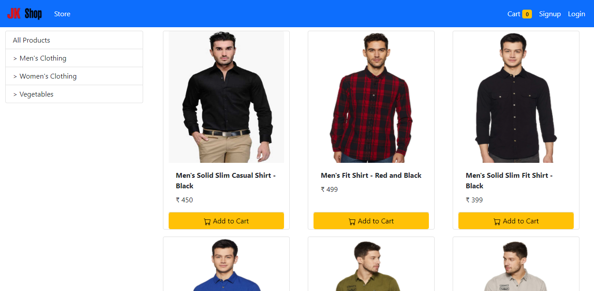
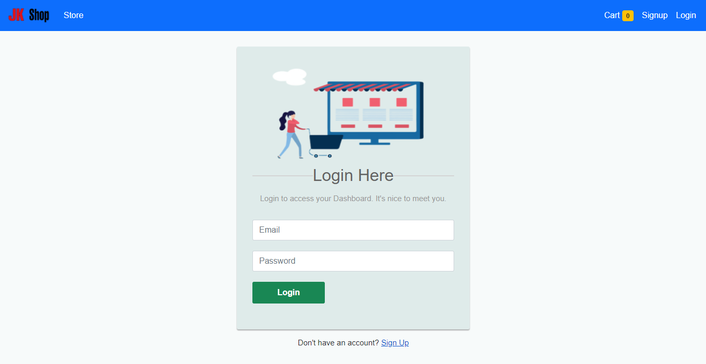
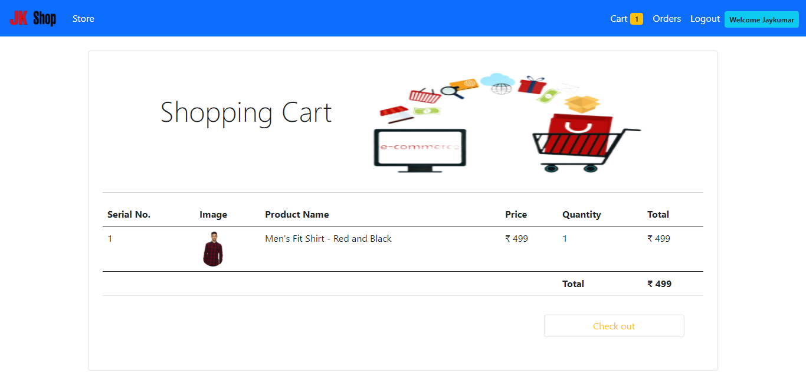
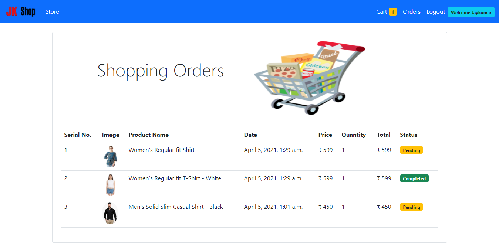

# Django-Ecommerce-Website

E-Commerce websites are online portals that facilitate online transactions of goods and services through means of the transfer of information and funds over the Internet.

## Project Overview

  * Made fully project with pure Django. Not included JavaScript.
  
  * It's an e-commerce web application. Admin can add a products in site.
  
  * After customer did signup or login they can add products in cart and purchase it.
  
  * Then admin will check these order and confirm for deliver products to customers.

## Project View
  
  1. Home Page
  
  
  
  1. Login Page
  
  
  
  1. Cart Page
  
  
  
  1. Orders Page
  
  
  
  
## Technical Features

  ### `Models`
  
  ### `Admin Site`
  
  ### `CRUD Operations`
  
  ### `Passord Hashing`
  
  ### `Authorization`
  
  ### `Authentication`
  
  ### `Session Handling`
  
  ### `csrf_token`
  
  ### `Template Language`
  
  ### `Image uploading`
  
  ### `Making uerie`
  
  ### `Middleware`
  
  ### `Filter`
  
  
## Learn More

  You can learn more in the [django documention](https://docs.djangoproject.com/en/3.2/).

  To learn Django Rest Framework, check out the [React documentation](https://www.django-rest-framework.org/).
  
